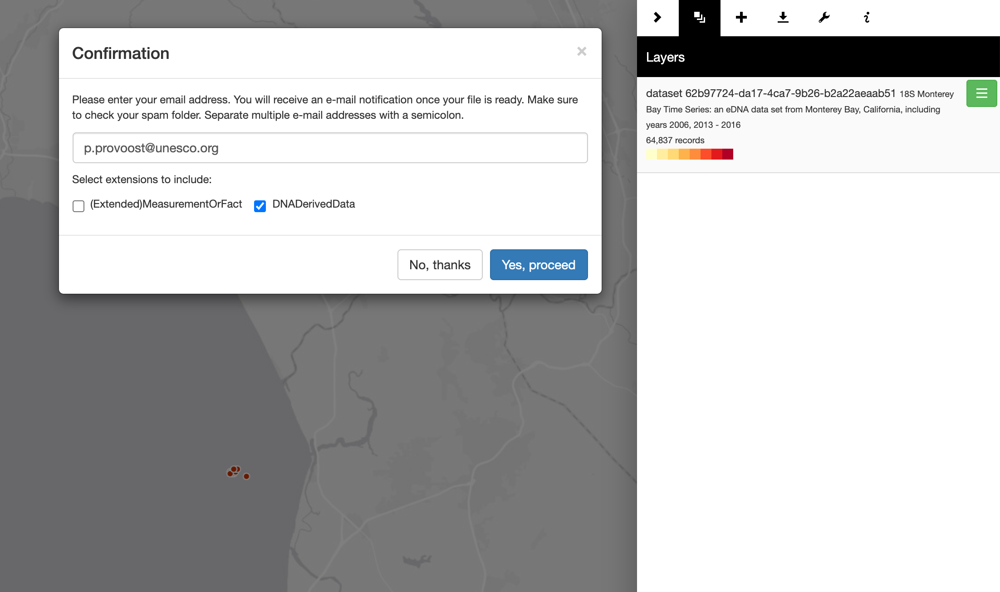
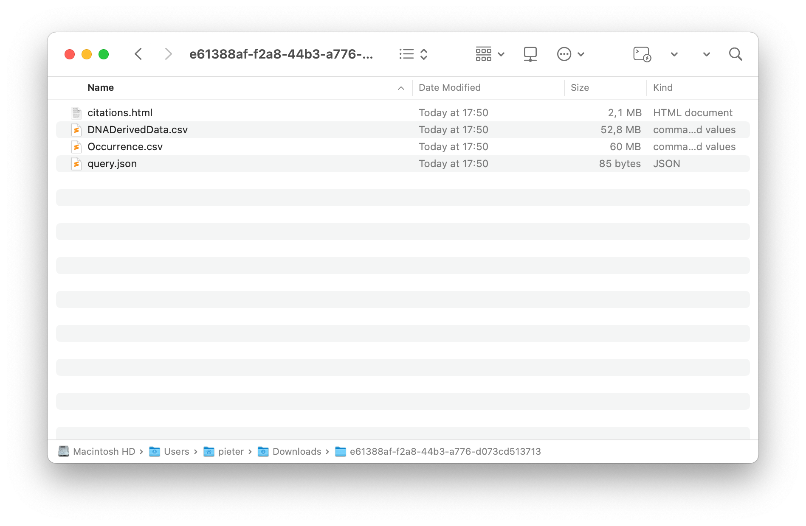

In this notebook we will explore data published to OBIS using the new [DNADerivedData extension](https://rs.gbif.org/extension/gbif/1.0/dna_derived_data_2021-07-05.xml). This notebook is available at [https://iobis.github.io/notebook-dnaderiveddata/](https://iobis.github.io/notebook-dnaderiveddata/).

# Using R
## Installing the robis package

First install the [robis package](https://github.com/iobis/robis). If the package is already installed, make sure the version is 2.10.0 or higher.

```{r message=FALSE, warning=FALSE}
if (!"robis" %in% rownames(installed.packages())) {
  remotes::install_github("iobis/robis")
} else if (packageVersion("robis") < "2.10.0") {
  knitr::knit_exit()
}
```

We will also need the following packages:

```{r message=FALSE, warning=FALSE}
library(robis)
library(dplyr)
library(ggplot2)
library(knitr)
library(ggtree)
```

## Finding sequence based data

Before we fetch any occurrence data let's first find out which datasets in OBIS are using the DNADerivedData extension. The `dataset()` function takes many of the same parameters as the `occurrence()` function, including `hasextensions` which allows us to limit our search to occurrences which have linked extension records of a specific type. Possible values include `MeasurementOrFact` and `DNADerivedData`.

```{r message=FALSE, warning=FALSE}
dna_datasets <- dataset(hasextensions = "DNADerivedData")

dna_datasets %>%
  select(url, title, records) %>%
  kable()
```

```{r message=FALSE, warning=FALSE}
mapview::mapview(sf::st_as_sfc(dna_datasets$extent, crs = 4326))
```

## Fetching sequence based data

Let's fetch all occurrences from the 18S Monterey Bay Time Series dataset by using the `datasetid` parameter. Alternatively, set `hasextensions` to `DNADerivedData`. Also set the `extensions` parameter to ensure that the nested extension records are included in the results.

```{r message=FALSE, warning=FALSE}
occ <- occurrence(datasetid = "62b97724-da17-4ca7-9b26-b2a22aeaab51", extensions = "DNADerivedData")
occ
```

Let's take a look at the taxonomic composition of our dataset:

```{r message=FALSE, warning=FALSE}
occ %>%
  group_by(phylum) %>%
  summarize(species = length(unique(speciesid)), records = n()) %>%
  arrange(desc(species))
```

## Extracting DNADerivedData records

The DNADerivedData records are currently nested within the occurrences we fetched from OBIS. To extract the extension records we can use the `unnest_extension()` function. Pass any fields from the occurrence table you would like to keep using the `fields` parameter.

```{r message=FALSE, warning=FALSE}
dna <- unnest_extension(occ, "DNADerivedData", fields = c("id", "phylum", "class", "order", "family", "genus", "species", "date_year"))
dna
```

Let's take a look at some properties of the sequence records.

```{r message=FALSE, warning=FALSE}
dna %>%
  group_by(target_gene, pcr_primer_name_forward, pcr_primer_name_reverse) %>%
  summarize(records = n()) %>%
  kable()
```

## Working with DNADerivedData records

This is a quick demo of working with sequences from the DNADerivedData extension. For the remainder of the notebook I will work with a subset of the sequence data.

```{r message=FALSE, warning=FALSE}
dna_subset <- dna %>%
  filter(phylum == "Ochrophyta" & !is.na(species)) %>%
  head(100)
```

To be able to make use of existing bioinformatics packages we first need to convert our `DNA_sequence` column to a `DNAbin` object. This can be done using `as.DNAbin` function from the `ape` (Analyses of Phylogenetics and Evolution) package.

```{r message=FALSE, warning=FALSE}
sequences <- sapply(strsplit(as.character(dna_subset$DNA_sequence), ""), tolower)
names(sequences) <- dna_subset$id
sequences <- ape::as.DNAbin(sequences)
sequences
```

Now we can align the sequences using MAFFT. The `ips` (Interfaces to Phylogenetic Software in R) package provides an interface to the MAFFT software.

```{r message=FALSE, warning=FALSE}
aligned <- ips::mafft(sequences, method = "auto")
aligned
```

Let's visualize the aligned sequences:

```{r message=FALSE, warning=FALSE}
ggmsa::ggmsa(aligned %>% as.list() %>% setNames(substr(names(sequences), 1, 5)), color = "Chemistry_NT", seq_name = TRUE) + theme(text = element_text(size = 5))
```

Finally, we can calculate a distance matrix and construct a tree using `dist.dna` and `njs`.

```{r message=FALSE, warning=FALSE}
distances <- ape::dist.dna(aligned, model = "raw")

tree <- ape::njs(distances) %>%
  left_join(dna_subset %>% select(id, year = date_year, species), by = c("label" = "id"))

ggtree(tree, layout = "circular", cex = 0.3) +
  geom_tiplab(size = 2, aes(label = species, color = year)) +
  scale_color_viridis_c(option = "magma", end = 0.9)
```

# Using the mapper

DNADerivedData extension records can also be included in data downloads from the [mapper](https://mapper.obis.org/). To do so, tick the DNADerivedData checkbox in the download confirmation form.



The resulting archive will include CSV files for the occurrences as well as for the selected extensions. The occurrence and extension tables can be joined using the `id` column.


